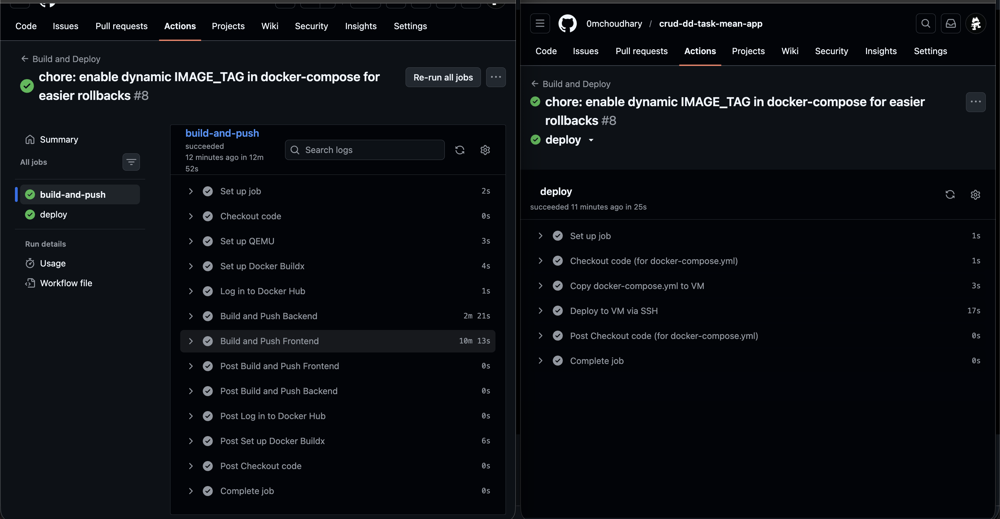

# MEAN Stack CRUD Application - DevOps Task

A full-stack CRUD application built with the MEAN stack (MongoDB, Express, Angular 15, and Node.js), containerized with Docker, and deployed via a GitHub Actions CI/CD pipeline to an Ubuntu VM.

## 🚀 Repository Contents
- **frontend/**: Angular 15 application with Dockerfile and Nginx configuration.
- **backend/**: Node.js/Express REST API with Dockerfile.
- **docker-compose.yml**: Orchestration for MongoDB, Backend, and Frontend (Nginx).
- **.github/workflows/deploy.yml**: CI/CD pipeline for automated testing, building, and deployment.

---

## 🛠 Tech Stack
- **Frontend**: Angular 15, Nginx (Reverse Proxy)
- **Backend**: Node.js, Express
- **Database**: MongoDB (Official Docker Image)
- **Infrastructure**: Docker, Docker Compose, GitHub Actions, Ubuntu VM (Cloud)

---

## 🐳 Containerization & Deployment

### 1. Local Run with Docker Compose
To run the entire stack locally:
```bash
docker compose up --build
```
The application will be available at `http://localhost`.

### 2. Infrastructure Details
- **Nginx Reverse Proxy**: Configured to serve the Angular frontend on port 80 and proxy `/api` requests to the Node.js backend on port 8080.
- **Networking**: All services (frontend, backend, mongodb) communicate within a Docker bridge network.

---

## 🔄 CI/CD Pipeline
The pipeline is triggered on every push to `main` or `dev` branches.

**Steps included:**
1. **Build**: Creates Docker images for both frontend and backend.
2. **Push**: Tags and pushes images to Docker Hub (`imomchoudhary/`).
3. **Deploy**: 
   - Connects to the Ubuntu VM via SSH.
   - Updates the `docker-compose.yml` file on the server.
   - Pulls the latest images from Docker Hub.
   - Restarts containers using `docker compose up -d`.

---

## 📸 Screenshots

### 1. CI/CD Configuration & Execution
*(Screenshot showing the GitHub Actions workflow file or the successful run history)*


### 2. Docker Image Build & Push
*(Screenshot of Docker Hub repository or GitHub Action logs showing the push)*


### 3. Application Deployment & UI
*(Screenshot of the application running on the VM's public IP)*


### 4. Infrastructure & Nginx
*(Screenshot showing running containers on the VM or Nginx configuration logs)*


---

## 📖 Setup Instructions (Step-by-Step)

### Prerequisites
- Docker & Docker Compose installed.
- Access to an Ubuntu VM (AWS/Azure/etc.).
- Docker Hub account.

### Automated Deployment
1. Fork/Clone this repository.
2. Set up the following **GitHub Secrets**:
   - `DOCKER_USERNAME`: Your Docker Hub username.
   - `DOCKER_PASSWORD`: Your Docker Hub password/token.
   - `VM_IP_ADDRESS`: Public IP of your Ubuntu VM.
   - `VM_SSH_USER`: SSH username (e.g., `ubuntu`).
   - `VM_SSH_KEY`: Private SSH key for VM access.
3. Push changes to the `main` branch to trigger the deployment.

### Manual Setup on VM
1. Transfer `docker-compose.yml` to the VM.
2. Run:
   ```bash
   docker compose up -d
   ```
3. Ensure port 80 is open in your cloud provider's Security Group.

---

## 🔗 Project Links
- **GitHub Repository**: [https://github.com/0mchoudhary/crud-dd-task-mean-app](https://github.com/0mchoudhary/crud-dd-task-mean-app)
- **Docker Hub**: [https://hub.docker.com/u/imomchoudhary](https://hub.docker.com/u/imomchoudhary)
